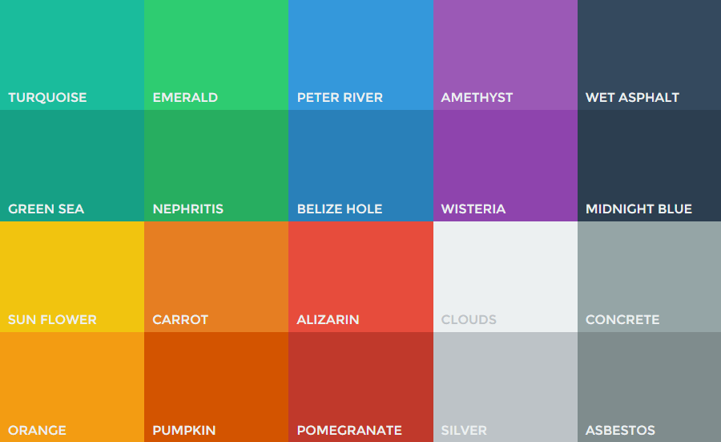

#MaterialCss

Inspired by [flatuicolors.com](http://flatuicolors.com/).

##Install with Bower

`bower install dfridrich-material-css`

##List of colors

##CSS styles

- *Colors* - prefix "c-", e.g. "c-turwuoise"
- *Backgrounds* - prefix "bg-", e.g. "bg-turwuoise"
- *Border colors* - prefix "bc-", e.g. "bc-turwuoise"